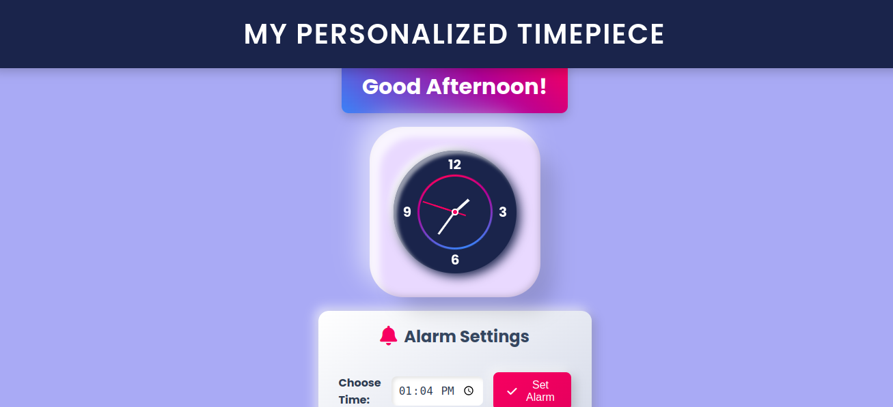

# animated-timepiece

## Personalized Animated Clock with Alarm
An interactive and visually appealing animated clock application(*animated-timepiece*) that displays the current time, greets users based on the time of day, and provides an alarm feature with snooze and stop functionality. This project is built using HTML, CSS, and JavaScript.

## Table of Contents
- **Features**
- **How It Works**
- **Project Structure**
- **Setup Instructions**
- **Key Selectors**
- **Contributing**
- **License**

## Animated Clock Features:
 **Real-Time Clock:**
- *Displays hours, minutes, and seconds with smooth animations.*
  
 **Dynamic Greetings:**
- *Updates greetings based on the time of day (morning, afternoon, evening).*
  
 **Alarm Functionality:**
- *Allows users to set an alarm using a time input field.*
- *Alarm triggers a sound, displays a message, and offers Snooze and Stop buttons.*
  
 **Customizable Snooze:**
- *Resets the alarm for an additional 5 minutes.*
  
 **Stylish UI:**
- *Modern design using gradients, shadows, and responsive layout.*

## How It Works
**Real-Time Clock**
- The clock updates every second using JavaScript, with degrees of rotation calculated for hours, minutes, and seconds.

**Alarm**
- Users set the alarm via the input field.
- When the current time matches the alarm time, an alert is triggered, and the alarm sound plays in a loop.
- Users can either snooze or stop the alarm.
**Styling**
- The project uses CSS for a visually rich interface, with animations and gradients enhancing the user experience.

## Key Selectors
- **Clock**
- Hours Hand: *.hrs*
- Minutes Hand: *.min*
- Seconds Hand: *.sec*
- **Alarm**
- Greeting Message: *greeting*
- Alarm Input Field: *alarm-time*
- Set Alarm Button: *set-alarm*
- Alarm Message Display: *alarm-message*
- **Alarm Buttons**
- Snooze Button: Dynamically created *(.alarm-button.snooze-button)*
- Stop Button: Dynamically created *(.alarm-button.stop-button)*

## Technology Stack:
*The Animated Clock project uses the following technologies and stacks*:

**Frontend**:
- HTML5: Structure and content of web pages.
- CSS3: Styling, animations, and layout.
- JavaScript: Real-time functionality and interactivity.

## Deployment:
GitHub Pages: Hosting and deployment for easy access.

## Development Tools:
Modular JavaScript and CSS files for easy customization and scalability.

## Future Improvements:
- **Multiple Themes**: Add more customizable themes for different looks.
- **Alarm Functionality**: Introduce an alarm feature with custom notifications.
- **Time Zone Support**: Allow users to switch between time zones.
- **Enhanced Animations**: Implement more complex and engaging animations.

## Usage Scenarios:
- *Check the time in a visually appealing way.*
- *Customize the clock's look with ease using CSS.*
- *Add interactive elements for a more engaging user experience.*

## Contributing
Contributions are welcome! If you have suggestions or want to report issues, feel free to submit a pull request or open an issue in the repository.

## License
This project currently does not have a specified license. You are free to use, modify, and share it as needed.

## Acknowledgments
A special thanks to myself for building this project and to all the users for their support and feedback.
